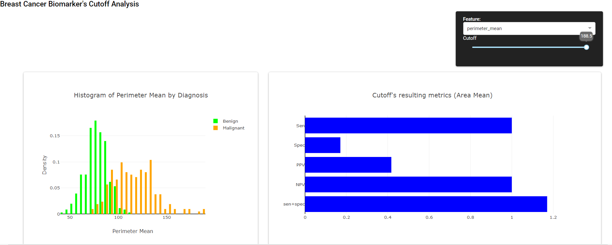

# Cutoff-value-analytic-dashboard
The dashboard presents histogram and metrics resulted from the input feature(biomarker) and cutoff for breast cancer diagnosis.

The dashboard was designed to help with deriving cutoff values for the diagnosis of breast cancer based on one or multiple biomarkers. The dataset used consists of 569 examples of breast cancer biopsies. Each example has 32 variables. Out of the 32 variables, 30 are continuous features(biomarkers), one is an identification number, and the other is diagnosis. The diagnosis outcomes are benign or malignant. The dashboard has a dropdown menu to select a feature and a slider to select a cutoff value for the selected feature and it generates two graphs based on the selection. The first graph is a histogram for the selected feature (biomarkers) colored by diagnosis(malignant vs. benign). The second graph presents the sensitivity, specificity, PPV, NPV, and the sum of sensitivity and specificity for the input feature and cutoff value.

